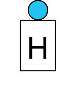
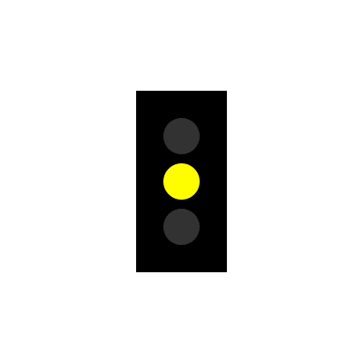
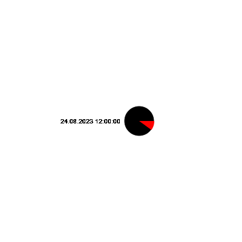

# infrastructure-simulator


You can send command via REST interface. See below


## Installation

```
pip install git+https://github.com/dfriedenberger/infrastructure-simulator
```
or
```
pip install -e .
```
## Usage 

see server.py

## Test
```
pip install fastapi hypercorn
python server.py
```

### Send Commands

```
curl --request POST --header "Content-Type: application/json" --data '{"id":"<item-id>","cmd":"<command>"}' http://localhost:8080/control/<board-name>
```


### Examples

#### Railway

<table>
    <tr>
        <td>Weiche </td>
        <td></td>
        <td><a href="docs/weiche.md">Details</a></td>
    </tr>
    <tr>
        <td>AusfahrsignalZs1 </td>
        <td></td>
        <td><a href="docs/ausfahrsignalzs1.md">Details</a></td>
    </tr>
    <tr>
        <td>AusfahrsignalZs2Zs3 </td>
        <td></td>
        <td><a href="docs/ausfahrsignalzs2zs3.md">Details</a></td>
    </tr>
    <tr>
        <td>HauptsignalZs2Zs3 </td>
        <td></td>
        <td><a href="docs/hauptsignalzs2zs3.md">Details</a></td>
    </tr>
    <tr>
        <td>EinfahrsignalZs1 </td>
        <td></td>
        <td><a href="docs/einfahrsignalzs1.md">Details</a></td>
    </tr>
    <tr>
        <td>BlocksignalZs1 </td>
        <td></td>
        <td><a href="docs/blocksignalzs1.md">Details</a></td>
    </tr>
    <tr>
        <td>Trapeztafel2000 </td>
        <td></td>
        <td><a href="docs/trapeztafel2000.md">Details</a></td>
    </tr>
    <tr>
        <td>Haltetafel2000 </td>
        <td></td>
        <td><a href="docs/haltetafel2000.md">Details</a></td>
    </tr>
</table>

#### Allgemein

<table>
    <tr>
        <td>Ampel </td>
        <td></td>
        <td><a href="docs/ampel.md">Details</a></td>
    </tr>
    <tr>
        <td>TestBild </td>
        <td></td>
        <td><a href="docs/testbild.md">Details</a></td>
    </tr>
</table>


