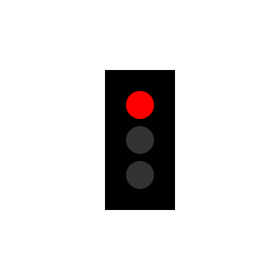
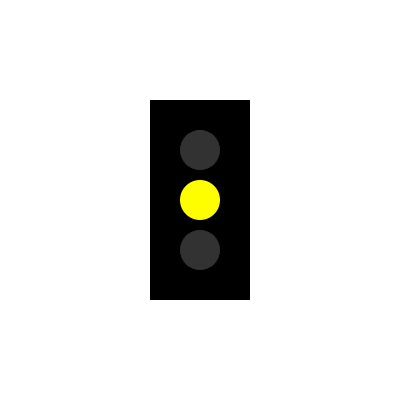
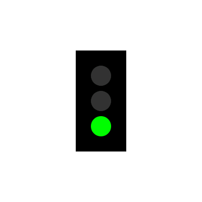
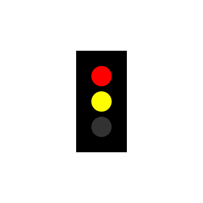

# Ampel


## Commands
### Halt "halt"



Example:
```
curl --request POST --header "Content-Type: application/json" --data '{"id":"ampel","cmd":"halt"}' http://localhost:8080/control/hello-world
```


### Achtung "achtung"



Example:
```
curl --request POST --header "Content-Type: application/json" --data '{"id":"ampel","cmd":"achtung"}' http://localhost:8080/control/hello-world
```


### Fahrt "fahrt"



Example:
```
curl --request POST --header "Content-Type: application/json" --data '{"id":"ampel","cmd":"fahrt"}' http://localhost:8080/control/hello-world
```


### Fahrt erwarten "fahrt_erwarten"



Example:
```
curl --request POST --header "Content-Type: application/json" --data '{"id":"ampel","cmd":"fahrt_erwarten"}' http://localhost:8080/control/hello-world
```


