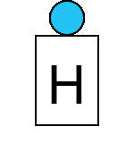

# Haltetafel2000


## Commands
### Sperren "on"



Example:
```
curl --request POST --header "Content-Type: application/json" --data '{"id":"haltetafel2000","cmd":"on"}' http://localhost:8080/control/hello-world
```


### Freigeben "off"


Example:
```
curl --request POST --header "Content-Type: application/json" --data '{"id":"haltetafel2000","cmd":"off"}' http://localhost:8080/control/hello-world
```


